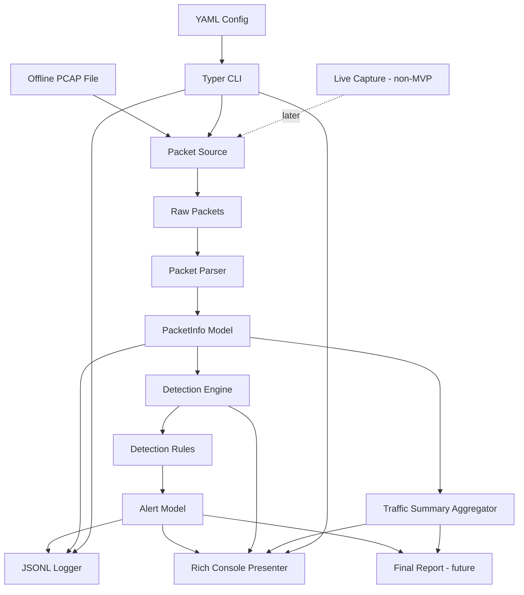

# Architecture

This document describes the high-level architecture of the Mini IDS / Network Security Monitor. The project now provides a configurable end-to-end offline PCAP analysis command with three detection rules and in-memory traffic aggregation, but it does not yet write final analysis reports or support live capture.

## Current Status

Implemented so far:

- Repository structure
- Python dependency setup
- Package import smoke test
- Scope, threat model, and architecture documentation
- `PacketInfo` packet metadata model
- `Alert` structured alert model
- Offline PCAP reader for raw Scapy packets
- Packet parser for individual Scapy packets
- Mock `PacketInfo` fixtures and example packet metadata
- Abstract detection rule interface
- Detection engine orchestration and basic statistics
- Vertical TCP SYN port-scan detection
- TCP connection-burst detection by source IP
- Independent packet and alert JSONL persistence
- Rich terminal presentation for alerts, detection summaries, and traffic summaries
- Basic Typer CLI for end-to-end offline PCAP analysis
- Typed YAML configuration for current detection rules
- DNS query-burst, unique-domain, and long-domain detection
- Aggregate traffic-summary generation and Rich presentation

Not implemented yet:

- Final analysis report files
- Live capture

## Architectural Goals

- Keep the tool defensive, passive, and educational.
- Start with reproducible offline PCAP analysis.
- Keep raw packet handling isolated from detection logic.
- Convert packets into simple internal models before rules process them.
- Keep detection rules small, explicit, and testable.
- Produce structured alerts that can be printed, logged, and reported.
- Avoid adding live capture, dashboards, or advanced integrations before the MVP is stable.

## MVP Architecture

The MVP focuses on offline analysis of PCAP files. Its basic command reads a PCAP, parses packet metadata, runs the two implemented rules, prints alerts and a terminal summary, and optionally writes structured packet and alert logs.

MVP components:

- Packet Source for offline PCAP files
- Packet Parser
- `PacketInfo` data model
- Detection Engine
- Detection Rules for port scan and connection burst behavior
- `Alert` data model
- Logger for JSONL alert output
- Console presenter for alerts, detection summaries, and traffic summaries
- Basic CLI for `analyze --pcap`

DNS anomaly detection was not required for the first MVP and is the first implemented v1.0 rule. Final JSON reports and live capture remain future work. YAML configuration is optional; omitting it preserves the rule defaults.

## Implemented MVP Data Flow

```text
PCAP file input
    -> raw packet reading
    -> packet metadata parsing
    -> PacketInfo objects
    -> detection engine
    -> enabled detection rules
    -> Alert objects
    -> TrafficSummary from the parsed PacketInfo collection
    -> optional packet and alert JSONL logs
    -> Rich alerts, detection summary, and traffic summary
```

## Component Responsibilities

### Packet Source

Module: `mini_ids/capture.py`

The packet source reads raw packets from offline PCAP files using Scapy. It handles file-level concerns such as missing paths, non-file paths, and invalid or unreadable captures.

The packet source should not parse packet fields into project models and should not run detection logic.

### Packet Parser

Module: `mini_ids/parser.py`

The parser converts raw Scapy packets into normalized `PacketInfo` objects. It extracts timestamps, source and destination IPs, ports, protocol, packet length, TCP flags, and DNS fields when available.

The parser should safely ignore or represent unsupported packets without crashing the analysis.

### PacketInfo Data Model

Module: `mini_ids/models.py`

`PacketInfo` is the internal representation of one parsed packet. Detection rules should use this model instead of raw Scapy packets.

Fields:

```text
timestamp: float
src_ip: str | None
dst_ip: str | None
src_port: int | None
dst_port: int | None
protocol: str
packet_length: int
tcp_flags: str | None
dns_query: str | None
dns_response: str | None
raw_summary: str | None
```

### Detection Engine

Module: `mini_ids/engine.py`

The detection engine coordinates rule execution. It receives `PacketInfo` objects, passes each packet to enabled detection rules, collects generated alerts, and tracks basic processing counts.

The engine should know how to call rules, but it should not contain rule-specific detection logic.

The implemented `DetectionEngine` runs rules in registration order and preserves the order of alerts returned by each rule. It tracks processed packets, generated alerts, and alert counts for every supported severity. Unexpected rule exceptions propagate to the caller; statistics for that packet are updated only after every rule succeeds. Engine statistics can be reset without resetting registered rules or their internal state.

### Detection Rules

Package: `mini_ids/rules/`

Detection rules inspect `PacketInfo` objects and return zero or more `Alert` objects. Rules may be stateful when they need time windows or counters.

The implemented `DetectionRule` interface requires stable rule metadata (`rule_id`, `name`, `description`, and `severity`) plus a `process_packet()` method. It does not prescribe how concrete rules store state or implement time windows.

`PortScanRule` is the first concrete rule. It detects one source sending TCP SYN packets without ACK to more than 10 distinct ports on one destination within an inclusive rolling 60-second window. The optional YAML configuration can override its constructor threshold and window or disable the rule.

`ConnectionBurstRule` detects one source sending more than 50 TCP SYN packets without ACK within an inclusive rolling 60-second window. It counts repeated attempts separately across all destinations and ports. Its evidence uses bounded destination summaries, and the optional YAML configuration can override its threshold and window or disable it.

`DNSAnomalyRule` evaluates normalized DNS queries by source IP. It detects more than 30 queries or more than 20 unique domains in an inclusive rolling 60-second window, plus normalized domain names longer than 70 characters. Query and unique-domain alert states suppress repeated alerts until expiry returns below their thresholds. Identical long-domain queries are suppressed until that domain has been absent from the active window. The rule uses one stable rule ID and records the anomaly subtype in structured evidence.

First MVP rules:

- Port scan detection: implemented
- Connection burst detection: implemented

v1.0 rule:

- DNS anomaly detection: implemented

Rules should include enough evidence in alerts to explain why they fired, such as source IP, destination IP, observed count, threshold, and time window.

### Alert Data Model

Module: `mini_ids/models.py`

`Alert` is the structured output of detection rules. Alerts should be easy to print, serialize to JSON, write to JSONL logs, and include optional MITRE ATT&CK references.

Fields:

```text
timestamp: str
rule_id: str
rule_name: str
severity: str
description: str
src_ip: str | None
dst_ip: str | None
src_port: int | None
dst_port: int | None
protocol: str | None
evidence: dict
mitre_attack: str | None
recommendation: str | None
```

### Logger

Module: `mini_ids/logger.py`

The logger writes structured output, starting with JSON Lines alert logs. Logging should avoid dumping unnecessary raw packet payloads and should prefer normalized packet and alert data.

The implemented JSONL writer persists `PacketInfo` and `Alert` records independently by reusing their model serialization. It writes UTF-8, creates parent directories, appends by default, and supports explicit overwrite mode. Each low-level function writes to the caller-provided path; filename generation belongs to future orchestration.

The basic CLI invokes the logger only when the caller supplies `--packet-log` or `--alert-log`. Each requested file uses explicit overwrite mode for a new analysis run. JSONL records remain individual packet or alert events; traffic summaries are not written by the logger.

### Console Presenter

Module: `mini_ids/console.py`

The console presenter renders individual alerts, ordered alert collections, detection-engine summaries, and bounded traffic summaries through Rich. Severity-aware styling improves scanning while labels keep output understandable when color is unavailable. Optional alert fields are omitted when absent, and evidence is bounded before display.

Console presentation does not calculate engine or traffic statistics, write files, parse CLI arguments, or coordinate packet analysis. JSONL persistence remains in `mini_ids/logger.py`; the CLI decides when to invoke each output layer.

### Configuration

Module: `mini_ids/config.py`

The configuration layer loads optional YAML into frozen `AppConfig`, `PortScanConfig`, `ConnectionBurstConfig`, and `DNSAnomalyConfig` dataclasses. Missing sections and fields use defaults equivalent to the rule constructors. Explicit validation rejects malformed YAML, unknown sections or fields, incorrect types, non-positive thresholds and windows, and non-finite windows.

`build_rules()` is the single configured rule-construction path. It emits enabled rules in deterministic port-scan, connection-burst, then DNS-anomaly order and omits disabled rules. Configuration does not contain placeholders for reporting or live capture.

### Traffic Summary Aggregator

Module: `mini_ids/reporting.py`

`build_traffic_summary()` consumes normalized `PacketInfo` objects and returns a frozen `TrafficSummary`. It counts total packets, source and destination IPs, destination ports, protocols, and DNS queries independently from `DetectionEngine` statistics. Missing endpoint metadata still contributes to the total without creating placeholder keys.

Top-source, top-destination, and top-port methods rank by descending count with deterministic lexical or numeric tie-breaking. `to_dict()` returns detached JSON-compatible data and stringifies destination-port keys only in the serialized representation. The module does not write files or combine traffic data with alerts into a final report; that remains Issue #27.

### CLI

Module: `mini_ids/cli.py`

The Typer CLI is the user-facing coordinator. It provides one offline analysis command with default rule settings:

```bash
python -m mini_ids.cli analyze --pcap pcaps/sample.pcap
```

The command preserves parser and alert order, keeps `OTHER` packets, skips parser results of `None`, and reports statistics only for parsed `PacketInfo` objects. The same parsed packet collection is passed to the engine and traffic aggregator without parsing raw packets again. Rich output shows alerts, the separate detection summary, and the traffic summary. Optional `--packet-log` and `--alert-log` paths write JSONL with explicit overwrite behavior. Optional `--config` loads validated YAML before rule construction; omitting it uses all three default rules.

Expected capture, configuration, and output-path errors are presented without tracebacks and return a non-zero exit code. Unexpected processing errors propagate. A configured run uses the same command with `--config`:

```bash
python -m mini_ids.cli analyze --pcap pcaps/sample.pcap --config examples/config.example.yaml
```

## v1.0 Architecture Additions

After the MVP works, v1.0 should add:

- JSON analysis reports
- Optional live capture mode
- More complete documentation and demo material
- CI for automated test execution

These additions should build on the same flow instead of replacing it.

## Future / Non-MVP Features

The following are explicitly future or non-MVP features:

- Live packet capture
- HTML or Markdown reports
- Dashboard UI
- SIEM integration
- Threat intelligence enrichment
- GeoIP enrichment
- Machine learning detection
- Docker packaging
- Performance benchmarking
- IPv6 expansion
- HTTP metadata extraction

The project should not implement offensive behavior such as packet injection, exploit execution, credential extraction, brute-force tooling, or automatic blocking.

## Mermaid Diagram



## Design Decisions

- Offline PCAP analysis is the first supported mode because it is safer, easier to test, and easier to demo.
- Live capture is non-MVP and should be added only after the offline workflow is reliable.
- DNS anomaly detection is the first implemented v1.0 rule.
- Configuration is optional, strict, and limited to implemented rules.
- Detection rules should process normalized `PacketInfo` objects, not raw Scapy packets.
- Alerts should be structured data, not plain strings.
- The logger, traffic aggregator, and future report writer are separate because event persistence, in-memory statistics, and complete report files have different responsibilities.
- The CLI should coordinate existing components rather than contain parsing, detection, or logging logic.

## Development Setup

Development dependencies are listed in `requirements.txt`. Use a local virtual environment and run `python -m pytest` from the repository root to verify the full suite.
