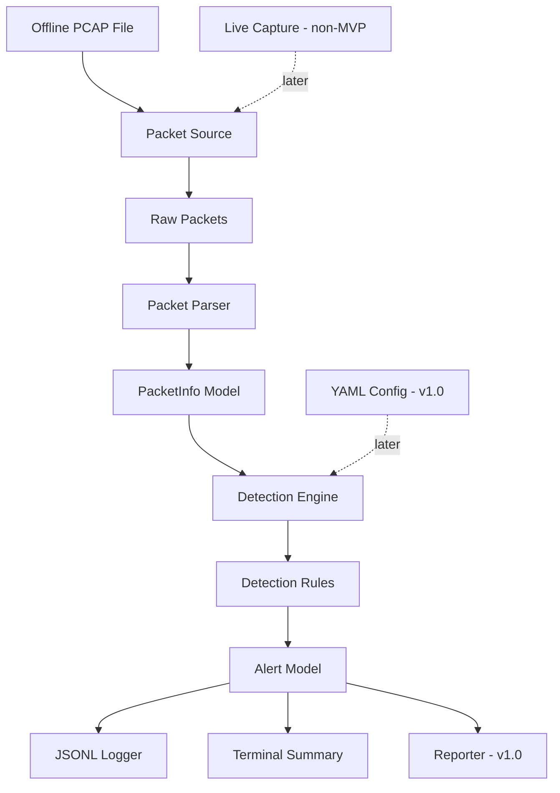

# Architecture

This document describes the planned high-level architecture of the Mini IDS / Network Security Monitor. The project is still in an early implementation phase and does not yet perform full PCAP analysis or complete threat detection.

## Current Status

Implemented so far:

- Repository structure
- Python dependency setup
- Package import smoke test
- Scope, threat model, and architecture documentation
- `PacketInfo` packet metadata model
- `Alert` structured alert model
- Offline PCAP reader for raw Scapy packets
- Packet parser for individual Scapy packets
- Mock `PacketInfo` fixtures and example packet metadata
- Abstract detection rule interface
- Detection engine orchestration and basic statistics
- Vertical TCP SYN port-scan detection
- TCP connection-burst detection by source IP

Not implemented yet:

- DNS anomaly detection
- CLI commands
- Logging
- Reporting
- Configuration loading
- Live capture

## Architectural Goals

- Keep the tool defensive, passive, and educational.
- Start with reproducible offline PCAP analysis.
- Keep raw packet handling isolated from detection logic.
- Convert packets into simple internal models before rules process them.
- Keep detection rules small, explicit, and testable.
- Produce structured alerts that can be printed, logged, and reported.
- Avoid adding live capture, dashboards, or advanced integrations before the MVP is stable.

## MVP Architecture

The MVP focuses on offline analysis of PCAP files. It should support a simple command that reads a PCAP, parses packet metadata, runs a small set of rules, prints a terminal summary, and writes structured alert logs.

MVP components:

- Packet Source for offline PCAP files
- Packet Parser
- `PacketInfo` data model
- Detection Engine
- Detection Rules for port scan and connection burst behavior
- `Alert` data model
- Logger for JSONL alert output
- Basic CLI for `analyze --pcap`

DNS anomaly detection, configuration files, final JSON reports, and live capture are not required for the first MVP.

## Planned Data Flow

```text
PCAP file input
    -> raw packet reading
    -> packet metadata parsing
    -> PacketInfo objects
    -> detection engine
    -> enabled detection rules
    -> Alert objects
    -> JSONL alert log
    -> terminal summary
```

## Component Responsibilities

### Packet Source

Planned module: `mini_ids/capture.py`

The packet source is responsible for reading packets from an input source. The first supported source should be offline PCAP files using Scapy. It should handle file-level concerns such as missing files, invalid PCAPs, and safe iteration over packets.

The packet source should not parse packet fields into project models and should not run detection logic.

### Packet Parser

Planned module: `mini_ids/parser.py`

The parser converts raw Scapy packets into normalized `PacketInfo` objects. It should extract metadata such as timestamps, source and destination IPs, ports, protocol, packet length, TCP flags, and DNS fields when available.

The parser should safely ignore or represent unsupported packets without crashing the analysis.

### PacketInfo Data Model

Planned module: `mini_ids/models.py`

`PacketInfo` is the internal representation of one parsed packet. Detection rules should use this model instead of raw Scapy packets.

Planned fields:

```text
timestamp: float
src_ip: str | None
dst_ip: str | None
src_port: int | None
dst_port: int | None
protocol: str
packet_length: int
tcp_flags: str | None
dns_query: str | None
dns_response: str | None
raw_summary: str | None
```

### Detection Engine

Module: `mini_ids/engine.py`

The detection engine coordinates rule execution. It receives `PacketInfo` objects, passes each packet to enabled detection rules, collects generated alerts, and tracks basic processing counts.

The engine should know how to call rules, but it should not contain rule-specific detection logic.

The implemented `DetectionEngine` runs rules in registration order and preserves the order of alerts returned by each rule. It tracks processed packets, generated alerts, and alert counts for every supported severity. Unexpected rule exceptions propagate to the caller; statistics for that packet are updated only after every rule succeeds. Engine statistics can be reset without resetting registered rules or their internal state.

### Detection Rules

Package: `mini_ids/rules/`

Detection rules inspect `PacketInfo` objects and return zero or more `Alert` objects. Rules may be stateful when they need time windows or counters.

The implemented `DetectionRule` interface requires stable rule metadata (`rule_id`, `name`, `description`, and `severity`) plus a `process_packet()` method. It does not prescribe how concrete rules store state or implement time windows.

`PortScanRule` is the first concrete rule. It detects one source sending TCP SYN packets without ACK to more than 10 distinct ports on one destination within an inclusive rolling 60-second window. Thresholds are currently constructor arguments because configuration loading has not been implemented.

`ConnectionBurstRule` detects one source sending more than 50 TCP SYN packets without ACK within an inclusive rolling 60-second window. It counts repeated attempts separately across all destinations and ports. Its evidence uses bounded destination summaries, and its thresholds are also constructor arguments.

First MVP rules:

- Port scan detection: implemented
- Connection burst detection: implemented

v1.0 rule:

- DNS anomaly detection

Rules should include enough evidence in alerts to explain why they fired, such as source IP, destination IP, observed count, threshold, and time window.

### Alert Data Model

Planned module: `mini_ids/models.py`

`Alert` is the structured output of detection rules. Alerts should be easy to print, serialize to JSON, write to JSONL logs, and include optional MITRE ATT&CK references.

Planned fields:

```text
timestamp: str
rule_id: str
rule_name: str
severity: str
description: str
src_ip: str | None
dst_ip: str | None
src_port: int | None
dst_port: int | None
protocol: str | None
evidence: dict
mitre_attack: str | None
recommendation: str | None
```

### Logger

Planned module: `mini_ids/logger.py`

The logger writes structured output, starting with JSON Lines alert logs. Logging should avoid dumping unnecessary raw packet payloads and should prefer normalized packet and alert data.

For the MVP, alert logging is enough. Packet logging and richer formats can come later if useful.

### Reporter

Planned module: `mini_ids/reporting.py`

The reporter will create higher-level summaries after analysis. This is a v1.0 addition, not a requirement for the first basic CLI.

Planned report data includes packet counts, alert counts, severity counts, top sources, top destinations, top ports, and generated alerts.

### CLI

Planned module: `mini_ids/cli.py`

The CLI is the user-facing entry point. The first useful command should analyze an offline PCAP with default settings:

```bash
python -m mini_ids.cli analyze --pcap pcaps/sample.pcap
```

Configuration support is useful, but it is not required for the first basic CLI. A later version can add:

```bash
python -m mini_ids.cli analyze --pcap pcaps/sample.pcap --config examples/config.example.yaml
```

## v1.0 Architecture Additions

After the MVP works, v1.0 should add:

- YAML configuration for thresholds and rule enable/disable settings
- DNS anomaly detection
- Traffic summaries
- JSON analysis reports
- Optional live capture mode
- More complete documentation and demo material
- CI for automated test execution

These additions should build on the same flow instead of replacing it.

## Future / Non-MVP Features

The following are explicitly future or non-MVP features:

- Live packet capture
- HTML or Markdown reports
- Dashboard UI
- SIEM integration
- Threat intelligence enrichment
- GeoIP enrichment
- Machine learning detection
- Docker packaging
- Performance benchmarking
- IPv6 expansion
- HTTP metadata extraction

The project should not implement offensive behavior such as packet injection, exploit execution, credential extraction, brute-force tooling, or automatic blocking.

## Mermaid Diagram



## Design Decisions

- Offline PCAP analysis is the first supported mode because it is safer, easier to test, and easier to demo.
- Live capture is non-MVP and should be added only after the offline workflow is reliable.
- DNS anomaly detection belongs to v1.0, not the first MVP.
- Configuration loading is useful but should not block the first basic CLI.
- Detection rules should process normalized `PacketInfo` objects, not raw Scapy packets.
- Alerts should be structured data, not plain strings.
- The logger and reporter are separate because logs are event-level output while reports are run-level summaries.
- The CLI should coordinate existing components rather than contain parsing, detection, or logging logic.

## Development Setup

Development dependencies are listed in `requirements.txt`. Use a local virtual environment and run `python -m pytest` from the repository root to verify the current smoke test.
