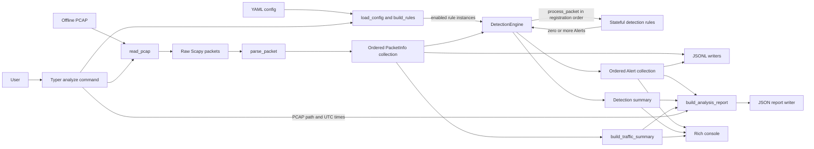

# Architecture

## Purpose and Scope

Mini IDS is a lightweight defensive monitor for offline PCAP analysis. Its current architecture has one input mode, one normalization boundary, a small set of stateful heuristic rules, and several independent output paths.

| Boundary | Current scope |
| --- | --- |
| Input | A local offline PCAP, optional YAML configuration, and optional output paths |
| Processing | Scapy packet reading, metadata normalization, stateful rule evaluation, and aggregate traffic counting |
| Output | Rich terminal output, packet and alert JSONL, in-memory traffic statistics, and one complete JSON analysis report |

The system is not an inline intrusion-prevention system, packet blocker, exploit detector, payload-signature engine, or enterprise-scale IDS replacement. Live capture and automatic remediation are not implemented.

## Architectural Principles

- **Offline-first and deterministic:** PCAP input and fixed packet timestamps make behavior reproducible and safe to test.
- **Normalize at the boundary:** detection code receives `PacketInfo`, not raw Scapy packets.
- **Passive and defensive:** the runtime reads supplied files and never transmits packets or modifies network policy.
- **Stateful but modular rules:** each rule owns only the state needed for its detection window.
- **Explicit dependency direction:** core models and rule logic do not depend on Typer, Rich, or filesystem orchestration.
- **Separated responsibilities:** detection, persistence, aggregation, presentation, and orchestration remain distinct.
- **Strict configuration:** unknown fields and invalid values fail rather than being ignored or coerced.
- **Visible failures:** expected user errors are translated at the CLI boundary; unexpected programming errors propagate.

## System Context

The user invokes the Typer CLI with a required local PCAP path. An optional YAML file controls which implemented rules are created and their thresholds. Optional paths request packet JSONL, alert JSONL, or a complete JSON report.

A successful analysis always renders ordered alerts, a detection summary, and a traffic summary. File outputs are created only when the corresponding path is supplied.

```text
User
  -> mini_ids.cli analyze
       <- offline PCAP file
       <- optional YAML configuration
       -> Rich alerts and summaries
       -> optional packet JSONL
       -> optional alert JSONL
       -> optional JSON analysis report
```

## End-to-End Data Flow

The implemented `analyze` flow is:

1. The Typer command calls `load_config()` to load defaults or validate the supplied YAML.
2. `analyze_pcap()` captures the UTC start time and `read_pcap()` loads raw Scapy packets from the local PCAP.
3. `parse_packet()` converts each raw packet into `PacketInfo`; only `None` results are skipped.
4. The CLI stores normalized packets in their original order.
5. `build_rules()` creates enabled rules in deterministic order, and the CLI constructs `DetectionEngine` with them.
6. `DetectionEngine.process_packets()` passes each packet to every registered rule.
7. The engine collects ordered `Alert` objects and produces detection statistics.
8. `build_traffic_summary()` aggregates the same normalized packet collection without reparsing.
9. The UTC finish time is captured after detection and traffic aggregation.
10. Requested packet and alert JSONL files are written from the completed collections.
11. If requested, `build_analysis_report()` combines timestamps, detection statistics, traffic statistics, and alerts; `write_analysis_report()` writes one JSON document.
12. Rich renders alerts, the detection summary, and the traffic summary.

Raw Scapy packets do not cross into detection rules. Packets are parsed once, packet order is preserved, rules execute in registration order, and alerts retain packet and rule execution order. Traffic aggregation and report generation reuse completed analysis data and do not reread the PCAP.

## Architecture Diagram



The engine invokes rules; rules return alerts to the engine. The report builder consumes already completed results and does not call capture, parsing, or detection code.

## Module Responsibilities

| Module | Main public API | Owns | Deliberately does not own |
| --- | --- | --- | --- |
| `mini_ids/models.py` | `PacketInfo`, `Alert`, `Severity`, `SEVERITY_LEVELS` | Normalized packet and alert contracts plus model serialization | Scapy parsing, rule execution, file output |
| `mini_ids/capture.py` | `read_pcap()`, `PcapReadError` | Local PCAP existence checks and raw Scapy packet loading | Metadata normalization and detection |
| `mini_ids/parser.py` | `parse_packet()` | Conversion of one Scapy packet into one normalized `PacketInfo` | PCAP I/O, rule state, output |
| `mini_ids/config.py` | `load_config()`, `build_rules()`, `AppConfig` and nested configs, `ConfigError` | YAML loading, strict validation, defaults, concrete rule construction | CLI parsing and detection execution |
| `mini_ids/engine.py` | `DetectionEngine` | Rule registration, ordered execution, alert collection, detection counters | Rule-specific logic, traffic aggregation, persistence |
| `mini_ids/logger.py` | `write_packet_jsonl()`, `write_packets_jsonl()`, `write_alert_jsonl()`, `write_alerts_jsonl()` | JSONL persistence for existing models | Diagnostic logging, aggregate reports, filename generation |
| `mini_ids/console.py` | `print_alert()`, `print_alerts()`, `print_summary()`, `print_traffic_summary()` | Bounded human-readable Rich presentation | Detection, aggregation, persistence, CLI options |
| `mini_ids/reporting.py` | `TrafficSummary`, `AnalysisReport`, `build_traffic_summary()`, `build_analysis_report()`, `write_analysis_report()` | Aggregate traffic metadata and complete JSON report construction | Packet parsing, rule execution, JSONL streams |
| `mini_ids/cli.py` | Typer `app`, `analyze`, `analyze_pcap()`, `main()` | Composition and user-facing error translation | Duplicating capture, parser, rule, logger, console, or report internals |
| `mini_ids/rules/base.py` | `DetectionRule` | Abstract metadata and `process_packet()` contract | Concrete detection state or thresholds |
| `mini_ids/rules/port_scan.py` | `PortScanRule` | Per-source/destination distinct-port window state | Engine statistics or Scapy handling |
| `mini_ids/rules/connection_burst.py` | `ConnectionBurstRule` | Per-source connection-attempt window state | Distinct-port scan logic or orchestration |
| `mini_ids/rules/dns_anomaly.py` | `DNSAnomalyRule` | Per-source DNS volume, domain diversity, and long-name state | DNS payload inspection or enrichment |

`mini_ids/rules/__init__.py` provides the package-level exports used by the engine and configuration layer. Full rule conditions, evidence, suppression, and limitations are documented in [Detection Rules](detection-rules.md).

## Core Data Contracts

### PacketInfo

`PacketInfo` is a frozen dataclass representing one normalized packet. It carries a numeric timestamp, optional source and destination addresses and ports, normalized protocol text, packet length, and optional TCP flags, DNS metadata, and Scapy summary text. Supported parser protocol values include `TCP`, `UDP`, `ICMP`, `DNS`, and `OTHER`.

Optional network fields may be absent. Unsupported Scapy packet shapes can still become `PacketInfo(protocol="OTHER")`; non-Scapy inputs return `None`. The model contains no raw Scapy object or raw payload bytes. `to_dict()` and `to_json()` return JSON-compatible representations.

### Alert

`Alert` is a frozen dataclass emitted by rules. It includes a timestamp, rule identity, `Severity`, description, optional endpoint and protocol data, JSON-compatible evidence, an optional MITRE ATT&CK mapping, and an optional recommendation. `Severity` is constrained statically to `LOW`, `MEDIUM`, `HIGH`, or `CRITICAL`.

Alert serialization uses `to_dict()` and `to_json()`. Freezing prevents field reassignment, although nested dictionaries remain ordinary mutable Python objects; report construction deep-copies alerts before retaining them.

### TrafficSummary

`TrafficSummary` is a frozen dataclass produced from an iterable of `PacketInfo`. It records total packets plus source, destination, destination-port, protocol, and DNS-query counts. Deterministic top-N helpers rank counts with explicit tie-breaking. `to_dict()` returns copied mappings and converts integer destination-port keys to strings for JSON compatibility.

### AnalysisReport

`AnalysisReport` represents one completed analysis. It contains the supplied PCAP path, UTC-normalized start and finish timestamps, a normalized detection summary, a detached `TrafficSummary`, and an ordered tuple of detached `Alert` objects.

`build_analysis_report()` rejects naive timestamps, finish times before start times, malformed detection summaries, and alert-count mismatches. `to_dict()` returns detached JSON-compatible data; `to_json()` returns one deterministic JSON document. Raw packets and full `PacketInfo` collections are intentionally excluded.

### AppConfig

`AppConfig` contains frozen `PortScanConfig`, `ConnectionBurstConfig`, and `DNSAnomalyConfig` values. Each nested model stores `enabled`, its rule thresholds, and its rolling-window duration. The models contain normalized scalar values only and do not retain YAML parser objects or mutable global state.

## Detection Engine and Rule Lifecycle

`DetectionRule` requires `rule_id`, `name`, `description`, `severity`, and `process_packet(packet) -> list[Alert]`. Concrete rules operate on one `PacketInfo` at a time and retain mutable state on their own instances.

`DetectionEngine`:

- executes rules in registration order;
- preserves each rule's returned alert order;
- increments the packet count once after all rules process a packet successfully;
- tracks total alerts and counts for every supported severity;
- exposes snapshot statistics through `get_summary()`;
- resets engine counters through `reset_statistics()` without resetting rule state; and
- allows unexpected rule exceptions to propagate.

If a rule raises, the failing packet is not added to engine statistics because counter updates occur after the rule loop. The engine does not implement transactional rollback, so state already changed by an earlier rule during that packet is not automatically reversed.

`build_rules()` creates enabled rules in this deterministic order:

1. `PortScanRule`
2. `ConnectionBurstRule`
3. `DNSAnomalyRule`

A caller can also construct an engine manually or register another `DetectionRule` instance, but there is no plugin discovery or dynamic import system.

## Stateful Window Processing

Current rules use packet timestamps and standard-library collections:

- `PortScanRule` keys state by `(src_ip, dst_ip)` and combines a deque of observations with a destination-port counter.
- `ConnectionBurstRule` keys a deque of connection attempts by source IP.
- `DNSAnomalyRule` keys observations, domain counters, long-domain last-seen values, and independent alert states by source IP.

When a relevant packet arrives, a rule expires observations older than its rolling window, adds the new observation, evaluates its threshold, and updates suppression state. Alert-state flags prevent one alert per packet while a source remains above a threshold. A rule re-arms after active state returns to the threshold or below. Out-of-order relevant timestamps older than the latest accepted timestamp for that key are ignored.

Expiry is packet-driven. There is no background timer or maintenance thread, so inactive keys are not cleaned until later relevant traffic for that key is processed. Rule state exists only for the lifetime of the rule instance and is not persisted across CLI executions.

## Configuration Architecture

Configuration is optional. `load_config(None)` returns defaults equivalent to the concrete rule constructors. Empty YAML and omitted sections or fields also retain defaults.

The supported hierarchy is:

```text
rules
├── port_scan
│   ├── enabled
│   ├── port_threshold
│   └── time_window_seconds
├── connection_burst
│   ├── enabled
│   ├── connection_threshold
│   └── time_window_seconds
└── dns_anomaly
    ├── enabled
    ├── query_threshold
    ├── unique_domain_threshold
    ├── long_domain_threshold
    └── time_window_seconds
```

Validation rejects unknown root fields, unknown rules, unknown rule fields, wrong types, booleans used as numbers, non-positive thresholds or windows, and non-finite windows. Strings such as `"10"` are not coerced into numbers.

`build_rules()` is the only configured rule-construction path used by the CLI. It omits disabled rules and passes normalized values to enabled constructors. Disabling every rule is valid; packets are still parsed, counted, logged if requested, aggregated, and displayed with zero alerts. The public `analyze_pcap()` helper can also be called without an `AppConfig`; in that case it loads defaults after parsing and before engine construction. See the [example configuration](../examples/config.example.yaml).

## Output Architecture

### Console Output

`mini_ids.console` renders alerts, detection statistics, and bounded traffic rankings through Rich. It accepts an optional `Console` for testability and does not calculate or mutate the supplied results.

### JSONL Persistence

`mini_ids.logger` writes either `PacketInfo` or `Alert` objects as one JSON object per line. Low-level writers create parent directories, preserve iteration order, append by default, and accept explicit overwrite through `append=False`. They reuse model serialization and do not wrap records in a second event schema.

The CLI calls collection writers with `append=False`, so each requested packet or alert log represents one analysis run.

### Traffic Summary

`build_traffic_summary()` performs one pass over normalized packets and returns in-memory aggregate metadata. It is separate from detection-engine statistics: the engine counts rule processing and alerts, while `TrafficSummary` counts observed packet metadata.

### Analysis Report

`build_analysis_report()` combines the explicit PCAP path, caller-supplied timestamps, a validated copy of the engine summary, a detached traffic summary, and detached ordered alerts. The report includes fixed top-five traffic rankings and no full packet records.

`write_analysis_report()` creates parent directories for the supplied path, writes UTF-8 JSON ending in one newline, and overwrites by default. Output layers do not choose directories, timestamps, or filenames; paths come from the caller. JSONL event streams and the complete analysis document remain different formats with different responsibilities.

Filesystem output is not transactional across files. If a later requested write fails, an earlier successful output may remain on disk and the error is still reported.

## CLI Orchestration

`mini_ids.cli` is the composition root. It owns the Typer application and the single `analyze` command:

| Option | Behavior |
| --- | --- |
| `--pcap PATH` | Required offline PCAP input |
| `--config PATH` | Optional validated YAML configuration |
| `--packet-log PATH` | Optional packet JSONL destination |
| `--alert-log PATH` | Optional alert JSONL destination |
| `--report PATH` | Optional complete JSON report destination |

`analyze_pcap()` coordinates existing public APIs and returns the engine summary. It captures timezone-aware UTC start and finish times, retains normalized packets once for engine processing and aggregation, and supplies the completed data to requested outputs. It does not duplicate packet parsing, detection logic, formatting, or serialization.

At the command boundary, anticipated `ConfigError`, `FileNotFoundError`, `PcapReadError`, and `OutputWriteError` failures become clear error messages and non-zero exits without expected-user-error tracebacks. Unexpected programming, rule, model, or validation failures are not caught broadly and therefore remain visible.

## Sample-Data Architecture

`scripts/generate_sample_pcaps.py` builds fixed Scapy packets in memory and writes them offline with `wrpcap()`. It uses documentation-only IP ranges, reserved example domains, fixed timestamps, and no raw application payloads. It never opens sockets, sniffs interfaces, or transmits packets.

The generated `pcaps/samples/manifest.json` records packet counts and expected alerts for every committed sample. Tests regenerate samples in temporary directories and compare normalized metadata and manifest contents with the committed copies. Arbitrary `.pcap` and `.pcapng` files remain ignored by Git; only the reviewed sample directory is allowed. See [PCAP Safety and Samples](../pcaps/README.md).

## Testing Architecture

The suite uses:

- focused unit tests for every production component;
- exact threshold, time-window, suppression, re-arming, and state-isolation tests for stateful rules;
- synthetic Scapy packets and temporary PCAP files;
- `tmp_path` for filesystem behavior and failure boundaries;
- Rich consoles backed by in-memory streams;
- Typer `CliRunner` for command behavior;
- public-API integration tests across capture, parsing, rules, aggregation, persistence, reporting, and presentation; and
- deterministic sample-PCAP safety and expected-alert validation.

The current verified baseline is 465 passing tests with 99% statement coverage, covering 951 of 958 production statements. Coverage is a regression signal, not proof of production security, correct thresholds for every environment, or freedom from false positives. See the [Testing Report](testing-report.md).

## Dependency Direction

The implementation is layered around the normalized models, but it is not presented as a perfectly isolated formal layer system. In the following map, `A -> B` means module A imports module B:

```text
capture -> Scapy
parser -> Scapy, models
rules.base -> models
concrete rules -> rules.base, models
engine -> models, rules package exports
config -> PyYAML, rules package exports and concrete rules
logger -> models
reporting -> models
console -> Rich, models, reporting
cli -> Typer, Rich Console, capture, config, console, engine,
       logger, models, parser, reporting
```

The CLI is the composition root. Rules depend on normalized models and the abstract contract, not on Typer, Rich, filesystem paths, configuration files, or Scapy. The engine imports `DetectionRule` through `mini_ids.rules`, whose package initializer also exports the concrete rule classes; concrete construction still remains in `config.build_rules()`.

## Error Boundaries

| Boundary | Public behavior |
| --- | --- |
| PCAP input | Missing paths raise `FileNotFoundError`; directories and invalid or unreadable captures raise `PcapReadError` with the underlying exception chained where applicable |
| Configuration | Missing, unreadable, malformed, unknown, and invalid configuration raises `ConfigError`; parser and read causes are chained where applicable |
| Rule execution | Unexpected rule exceptions propagate; the engine does not silently continue |
| JSONL and report writers | Parent directories are created; filesystem errors propagate to the caller |
| CLI | Expected capture, configuration, and output `OSError` failures are translated into concise non-zero exits; unexpected failures remain visible |

The low-level layers do not log and continue after an error. This keeps partial or invalid analysis states from being presented as successful.

## Security, Privacy, and Trust Boundaries

- Runtime analysis reads local files only; it does not transmit packets or perform live capture.
- The project performs no automatic blocking, firewall modification, exploitation, credential extraction, or active response.
- Models and outputs omit raw packet objects and raw payload bytes by design.
- Supplied PCAPs and generated outputs can still contain sensitive network metadata, including addresses, ports, DNS names, timestamps, and summaries.
- Private captures, logs, and reports are ignored by Git and should not be committed.
- The user is responsible for analyzing only traffic they own or are authorized to inspect.

The broader defensive scope and trust assumptions are documented in the [Threat Model](threat-model.md).

## Current Limitations and Trade-offs

- `read_pcap()` uses Scapy's `rdpcap()` behavior and returns a complete in-memory packet list.
- The CLI retains all normalized packets for engine processing, optional packet logging, traffic aggregation, and reporting.
- Processing is single-process and synchronous; there is no concurrency, backpressure, or streaming optimization.
- Rule windows depend on packet timestamps and packet-driven expiry rather than wall-clock timers.
- Rules assume nondecreasing relevant timestamps per state key and ignore older relevant observations.
- Detections are heuristic and threshold-based; false positives are possible and defaults may require tuning.
- There is no flow reconstruction, persistent session model, or TCP handshake validation beyond each rule's SYN/ACK assumptions.
- There is no payload inspection, encrypted-traffic decryption, or threat-intelligence enrichment.
- IPv6-specific endpoint normalization and advanced protocol analysis are not implemented.
- Rule and engine state is in memory and is not persisted across CLI executions.
- Output writes are independent rather than atomic as a group.
- No throughput, memory-use, or enterprise-scale performance guarantee has been established.

These trade-offs favor clarity, deterministic tests, and a compact educational codebase over scale and protocol breadth.

## Current and Future Architecture

Future entries are possibilities, not implemented commitments.

| Area | Current | Possible future |
| --- | --- | --- |
| Traffic source | Offline PCAP files | Optional authorized live capture |
| Reporting | JSONL events, Rich output, one JSON report | Optional HTML reporting |
| Processing | Single-process, in-memory analysis | Streaming and performance evaluation |
| Addressing | IPv4 endpoint extraction; unsupported shapes retain partial normalized metadata | Expanded IPv6 handling |
| Enrichment | None | Optional contextual enrichment |
| State | Per-run in-memory rule state | Evaluated persistence only if a future use case requires it |
| Automation | Local test and CLI commands | GitHub Actions CI |

No future item in this table is available through the current CLI.

## Architectural Decisions

| Decision | Rationale |
| --- | --- |
| Offline-first input | Keeps operation passive, reproducible, and safe without elevated privileges |
| Normalize into `PacketInfo` | Isolates Scapy details from detection and output layers |
| Structured `Alert` results | Makes evidence reusable across console, JSONL, tests, and reports |
| Stateful rule instances | Supports rolling-window behavior while keeping rule logic independent |
| Constructor thresholds plus typed YAML | Keeps rules directly testable and optionally user-tunable |
| Deterministic configured rule order | Produces stable alert ordering and reproducible tests |
| Separate engine and traffic statistics | Detection execution and observed traffic answer different questions |
| Separate JSONL and report formats | Event streams and complete analysis documents have different consumers |
| Explicit output paths | Avoids surprising files, naming rules, and implicit retention |
| Packet-driven expiry | Avoids background threads and keeps state transitions deterministic |
| No silent rule-error recovery | Prevents hidden detector failures and misleading success summaries |
| CLI as composition root | Keeps framework and filesystem orchestration outside core models and rules |

## Related Documentation

- [Project README](../README.md)
- [Detection Rules](detection-rules.md)
- [Threat Model](threat-model.md)
- [Testing Report](testing-report.md)
- [Example Configuration](../examples/config.example.yaml)
- [PCAP Safety and Samples](../pcaps/README.md)
