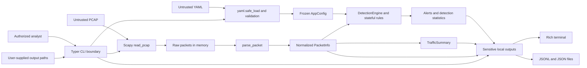

# Threat Model

## Purpose

This threat model defines the security, privacy, misuse, and trust assumptions of Mini IDS as currently implemented. The project accepts a user-supplied offline PCAP and optional YAML configuration, produces observations from normalized packet metadata, and may write packet logs, alert logs, traffic summaries, and a complete analysis report.

Mini IDS is a learning and portfolio project, a passive offline monitor, and a heuristic detector. It is not an inline control, prevention mechanism, forensic authority, or production IDS replacement. An alert identifies metadata that matched a rule; it does not prove malicious intent, identify a human actor, or prevent an attack.

## Scope

Included in this threat model:

- Typer CLI execution and argument handling
- Local offline PCAP reading through Scapy
- Packet normalization into `PacketInfo`
- Optional YAML loading and validation
- Detection-engine and stateful rule processing
- Structured `Alert` creation
- Rich console presentation
- Packet and alert JSONL persistence
- In-memory traffic summaries
- Complete JSON analysis reports
- Deterministic synthetic sample generation
- Local source code, tests, dependencies, and filesystem interactions

Explicitly outside the current system boundary:

- Live capture or network-interface access
- Packet transmission, replay, or injection
- Firewall, IPS, or automatic response enforcement
- Host-based and endpoint telemetry
- Authentication-system or service-log collection
- Cloud infrastructure or centralized SIEM deployment
- Payload-signature detection and encrypted-traffic decryption
- Enterprise availability, throughput, and scale guarantees

The monitored network itself is not protected by this tool. The project analyzes a capture of network activity after that activity has been recorded.

## Assets

| Asset | Security concern |
| --- | --- |
| PCAP content | Confidentiality of packet payloads, addresses, domains, ports, timestamps, credentials, and other captured data |
| Normalized packet metadata | Confidentiality and integrity of the packet facts used by rules and summaries |
| YAML configuration | Integrity of enabled rules, thresholds, and rolling windows |
| Detection results | Integrity and correct interpretation of alerts, evidence, counts, and severity values |
| JSONL logs and JSON reports | Confidentiality, integrity, retention, and correct association with the analyzed PCAP |
| Analysis availability | Ability to complete a local analysis without excessive memory, CPU, disk use, or crashes |
| Analyst trust | Avoiding false confidence, incorrect attribution, and mistaken treatment of heuristics as proof |
| Source code and tests | Integrity of rule behavior, defaults, error handling, sample contracts, and regression checks |
| Local environment | Integrity of Python, installed dependencies, filesystem permissions, and executed repository code |

Although detection and report models intentionally omit raw payload bytes, a supplied PCAP is not harmless metadata. Scapy's current reader loads complete raw packets, including any captured payload, into process memory before normalization. The project does not provide secure memory erasure or claim that sensitive input data never enters the process.

## Actors

### Authorized Analyst

Runs the tool on traffic they own or are permitted to inspect, selects configuration, chooses output paths, and interprets findings in context.

### Accidental or Inexperienced User

May provide a private capture, choose unsuitable thresholds, disable a rule unintentionally, write outputs to an exposed location, or interpret a heuristic alert as a confirmed incident.

### Malicious PCAP Provider

Provides malformed, oversized, incomplete, reordered, or adversarial packet data intended to exhaust resources, trigger parser edge cases, crash analysis, manipulate summaries, or create misleading alerts.

### Malicious Configuration Provider

Provides malformed, excessively large, or operationally misleading YAML. A syntactically valid configuration may disable rules, choose extreme thresholds, increase retained state, suppress expected findings, or create alert volume.

### Repository Contributor

Could introduce faulty logic, weaken validation or tests, alter defaults, replace synthetic samples, change dependencies, or add unsafe behavior. Code review and test integrity are therefore part of the trust model.

### External Actor Represented in Traffic

May generate traffic that is visible in the PCAP and may intentionally avoid simple threshold rules. A packet source address is a captured field, not authenticated identity, and an alerting source must not automatically be treated as malicious.

## Trust Boundaries

The primary trust boundaries are:

```text
Untrusted local PCAP
  -> Scapy capture and parser boundary
  -> normalized PacketInfo
  -> engine and rules

Untrusted optional YAML
  -> yaml.safe_load and explicit validation
  -> frozen typed AppConfig
  -> deterministic rule construction

Analysis results plus user-controlled output paths
  -> Rich terminal, JSONL writers, and JSON report writer

Repository code and installed dependencies
  -> local Python execution environment
```

PCAP and YAML files should be treated as untrusted even when they are local. Normalization reduces coupling between Scapy and detection code, but it does not validate the truth, provenance, or completeness of packet metadata. Output paths are trusted user input to ordinary filesystem operations and may reference unexpected files or symlinks. Generated outputs are not inherently trusted simply because Mini IDS created them; they can be modified after writing and may contain sensitive metadata.

The CLI is the composition boundary that loads configuration, invokes capture and parsing, constructs the engine, coordinates output, and translates expected user-facing failures.

## Trust-Boundary Diagram



Configuration reaches rule construction only after safe YAML parsing and validation. Raw packets cross a normalization boundary before detection, while output files remain subject to local path, permission, and tampering risks.

## Security-Relevant Data Flows

### Packet Flow

```text
PCAP on disk
  -> complete Scapy packet list in memory
  -> ordered PacketInfo collection in memory
  -> per-rule rolling state
  -> Alert objects and engine statistics
  -> console and optional files
```

The CLI retains normalized packets for detection, optional packet logging, traffic aggregation, and report construction. Rules retain observations needed for active windows. Alerts, summaries, and report data remain in memory through the run. Packet JSONL contains normalized packet records; alert JSONL and the final report contain findings and metadata but no complete packet collection. Data written to disk persists until the user removes it.

### Configuration Flow

```text
YAML on disk
  -> yaml.safe_load
  -> strict field and value validation
  -> frozen AppConfig and nested rule configs
  -> build_rules in deterministic order
```

The loader rejects unknown fields and invalid types and does not silently coerce strings into numbers. It cannot determine whether valid values are suitable for a particular network or analyst objective.

## Threat Categories

### Identity Ambiguity and Spoofing

- Source and destination addresses are values recorded in a capture and may be spoofed, translated, incomplete, or incorrectly attributed.
- The project does not authenticate packet origin, host ownership, user identity, or capture source.
- NAT, proxies, shared resolvers, load balancers, and missing capture context can make one address represent multiple systems or one system appear under several addresses.
- Alerts must not be interpreted as identity attribution.

### Tampering

- PCAP packets, timestamps, ordering, and capture contents may be altered before analysis.
- Valid YAML can change thresholds, windows, or rule enablement and thereby materially change results.
- JSONL files and reports can be edited, truncated, replaced, or combined with unrelated data after generation.
- Relative or absolute input and output paths may resolve to unintended local files depending on the current directory and filesystem state.
- The project does not hash or sign inputs, configuration, alerts, or reports and provides no chain-of-custody guarantee.

### Repudiation and Evidentiary Limits

- Results are analytical findings, not forensic proof or a verified incident record.
- Alert timestamps depend on timestamps in the supplied PCAP; analysis-report start and finish times describe local processing, not event provenance.
- Packet loss, capture filters, truncation, clock errors, and incomplete network visibility originate outside the tool and can change conclusions.
- There is no cryptographic provenance, immutable audit trail, analyst identity record, or capture acquisition log.

### Information Disclosure

- PCAPs may contain credentials, application payloads, internal addresses, hostnames, queried domains, personal information, and confidential service metadata.
- Packet JSONL can include timestamps, IPs, ports, protocol, flags, DNS fields, lengths, and Scapy summary text.
- Alerts and reports may reveal internal systems, behavior patterns, investigated hosts, MITRE context, and analyst-selected file locations.
- Terminal output can be retained by shells, terminal recorders, CI logs, remote sessions, or screen captures.
- File permissions are inherited from the local environment and process umask; the tool does not apply a restrictive permission policy.
- The committed samples are synthetic, but this provides no safety guarantee for user-supplied captures.

### Resource Exhaustion and Availability

- `read_pcap()` uses Scapy `rdpcap()` and returns a complete in-memory packet list.
- The CLI retains all normalized packets, and rules can retain observations for active source or source/destination keys.
- Very large captures, high-cardinality addresses, many ports or domains, long windows, or extreme packet rates can consume memory and CPU.
- Packet JSONL and reports can consume substantial disk space.
- Malformed inputs or dependency parser behavior may raise errors or terminate an analysis.
- YAML input size, PCAP size, packet count, execution time, memory, and output size have no current quotas or timeouts.

### Detection Evasion and False Negatives

An actor represented in traffic can avoid or reduce current visibility by:

- staying at or below configured thresholds;
- spreading activity across source addresses or destination hosts;
- extending activity beyond rolling windows;
- using packets that do not satisfy the current SYN-without-ACK assumptions;
- exploiting missing, unusable, or out-of-order timestamps;
- using IPv6 endpoint data or protocols not normalized for current rules;
- hiding behavior in encrypted traffic, payload content, or application semantics;
- using distributed, horizontal, UDP, or other scan forms not covered by the existing rules; or
- generating benign-looking cover traffic and patterns that resemble ordinary workloads.

No automatic baseline, flow reconstruction, session validation, payload inspection, endpoint correlation, resolver-log correlation, or authentication-log correlation exists. Absence of an alert does not mean absence of malicious activity.

### False Positives and Alert Ambiguity

Legitimate vulnerability scanners, inventory systems, monitoring agents, service discovery, browsers, operating systems, CDNs, automated tests, retries, broken clients, and high-volume workloads can match current heuristics.

MITRE ATT&CK mappings provide investigation context only. `T1046` on a port-scan alert and `T1071.004` on a DNS alert do not confirm technique execution, command-and-control, tunneling, or malicious intent. Connection-burst alerts intentionally have no MITRE mapping because volume alone is insufficiently specific.

### Configuration Misuse

- Low thresholds can create alert noise and reduce analyst trust.
- High thresholds can hide behavior that would otherwise alert.
- Rules may be disabled intentionally or accidentally; disabling every rule is valid configuration.
- Long windows can increase retained rule state.
- Strict validation prevents malformed values, unknown fields, and unsafe type coercion, but it cannot evaluate operational policy.
- Configuration files have no signature, provenance, approval workflow, or upper bounds for valid values.

### Output-Path and Filesystem Risks

- CLI packet logs, alert logs, and reports intentionally overwrite the user-supplied path for each run.
- A mistyped path can replace an unintended writable file.
- Path traversal, symlink resolution, mount behavior, filesystem permissions, and concurrent access are outside the current protection model.
- Parent directories are created for supplied paths.
- Multi-file output is not transactional; an earlier output can remain after a later write fails.
- Writers provide no atomic replacement, backup, integrity signature, or automatic retention policy.

### Dependency and Supply-Chain Risk

- Runtime and development behavior depends on Python, Scapy, PyYAML, Typer, Rich, pytest, and pytest-cov.
- A vulnerability, compromised package, incompatible release, or behavioral change in a dependency could affect parsing, configuration, output, or tests.
- `requirements.txt` currently names dependencies without version pins or hashes.
- A virtual environment isolates project packages from some system state but is not a security sandbox.
- GitHub Actions CI is configured for read-only tests on supported Python versions, but automated dependency scanning and release provenance are not implemented.

No specific dependency vulnerability is asserted by this document; this is a general supply-chain exposure.

## Detection Coverage and Visibility

| Rule | Current observation | Primary visibility limits |
| --- | --- | --- |
| `PORT_SCAN_001` | More than 10 distinct destination ports from TCP SYN without ACK for one source/destination pair within the default 60-second window | Vertical TCP SYN behavior only; no horizontal, UDP, distributed, or payload-aware scan detection |
| `CONNECTION_BURST_001` | More than 50 TCP SYN attempts without ACK from one source within the default 60-second window | Volume only; repeated attempts count, destinations may be missing, and intent is unknown |
| `DNS_ANOMALY_001` | More than 30 DNS queries, more than 20 normalized unique domains, or a normalized domain longer than 70 characters | No entropy model, tunneling confirmation, allowlist, suspicious-TLD logic, payload inspection, or threat intelligence |

Rules operate only on normalized packet metadata and packet timestamps. They do not reconstruct TCP streams, authenticate endpoints, learn baselines, correlate endpoint telemetry, or confirm attack techniques. Full rule semantics and false-positive notes are in [Detection Rules](detection-rules.md).

## Existing Mitigations

The following controls exist in the current implementation:

- **Offline-only runtime:** analysis does not open interfaces, send packets, or require root privileges.
- **Normalization boundary:** rules consume `PacketInfo` instead of raw Scapy packets.
- **Safe YAML loading:** configuration uses `yaml.safe_load` followed by strict typed field and value validation.
- **Deterministic rule construction:** `build_rules()` creates only enabled rules in a stable order.
- **Explicit conditions:** default boundaries, required fields, timestamp handling, and evidence are documented and tested.
- **Alert suppression:** stateful rules suppress repeated alerts while active and re-arm according to their window contracts.
- **Bounded presentation:** Rich limits rendered evidence; connection and DNS evidence use bounded top lists or samples.
- **Defined serialization:** packet, alert, traffic-summary, and analysis-report models provide explicit JSON-compatible representations.
- **Visible failures:** expected user errors become non-zero CLI failures, while unexpected rule and programming errors are not silently swallowed.
- **Safe samples:** committed PCAPs are generated offline from documentation addresses and reserved example domains without raw application payloads.
- **Repository exclusions:** arbitrary PCAPs, generated logs, and generated reports are ignored by Git; only reviewed sample PCAPs are allowed.
- **Testing:** unit, boundary, filesystem, CLI, integration, and sample-safety tests provide regression coverage.
- **Read-only CI configuration:** push and pull-request runs are limited to `contents: read` and require no repository secrets, live interfaces, or write permissions.
- **Explicit outputs:** the CLI writes files only when the user supplies paths and does not invent automatic filenames.
- **No automated response:** findings cannot directly block traffic or modify a firewall.

These controls reduce risk but do not make untrusted parsing, output storage, or heuristic interpretation safe by themselves.

## Residual Risks

After current mitigations:

- Scapy still parses untrusted, potentially sensitive complete packets in the analyst's process.
- Malformed or large PCAP and YAML files can still consume resources or trigger dependency errors.
- Memory exhaustion remains possible because capture, normalized packets, and active rule state are in memory.
- User-selected output paths can still overwrite files and follow symlinks.
- Output metadata can still reveal sensitive network and investigation information.
- Valid configuration can still weaken or disable detection.
- Alerts can be false, incomplete, evaded, or interpreted without necessary context.
- Rule state and detection history disappear when the process exits.
- Reports have no cryptographic integrity, capture provenance, or chain of custody.
- Parsing and analysis do not run in a sandbox.
- Dependency isolation is limited to the user's Python environment.
- No enterprise-scale performance or availability assurance exists.

## Security Assumptions

The current design assumes:

- the local operating system, Python interpreter, repository code, and installed dependencies are trusted;
- the analyst is authorized to inspect the supplied capture;
- filesystem permissions and the process umask are appropriate for sensitive inputs and outputs;
- the selected configuration is approved and understood by the analyst;
- PCAP timestamps and packet ordering are meaningful enough for rolling-window analysis;
- the capture contains enough of the relevant traffic path to observe the behavior of interest;
- the machine has sufficient memory, CPU, and disk space for the capture and requested outputs;
- users understand that source addresses are not authenticated identities; and
- findings are reviewed by a human who understands heuristic and visibility limitations.

When these assumptions do not hold, results may be unsafe to store, unavailable, misleading, or incomplete.

## Privacy Considerations

PCAPs can contain personal, confidential, or regulated information even when the analyst intends to inspect only metadata. The project does not make legal or regulatory compliance claims.

Packet JSONL may contain addresses, ports, DNS names and responses, flags, timestamps, lengths, and summary text. Alerts and reports can identify internal systems, behavioral patterns, and investigation focus. Console output may also be retained outside the application.

Users should select controlled input and output directories, apply appropriate filesystem permissions, avoid shared or automatically synchronized locations, and remove data when it is no longer needed. The tool provides no retention scheduler or secure deletion. Generated PCAPs, logs, and reports should not be committed unless they are reviewed synthetic artifacts. The bundled samples are synthetic and use documentation-only address ranges and reserved domains; see [PCAP Safety and Samples](../pcaps/README.md).

## Secure-Use Guidance

- Analyze only traffic you own or are explicitly authorized to inspect.
- Treat PCAP and YAML files from other parties as untrusted.
- Inspect configuration before use, including disabled rules and unusually large thresholds or windows.
- Store captures and outputs in appropriately protected local directories.
- Confirm output paths before running because requested files are overwritten.
- Avoid committing private PCAPs, packet logs, alert logs, or reports.
- Treat alerts as investigation leads, not conclusions or attribution.
- Correlate findings with authorized firewall, resolver, endpoint, authentication, and service logs.
- Prefer a constrained environment for very large or untrusted captures.
- Use mature IDS/NSM tooling and established operational controls for production monitoring.

## Misuse Cases

Mini IDS does not support or authorize:

- inspecting traffic without the owner or operator's permission;
- packet replay, injection, or transmission;
- active scanning or reconnaissance of third-party systems;
- exploit delivery, credential extraction, or payload theft;
- automated blocking, firewall modification, or retaliation;
- evasion testing against systems without explicit authorization; or
- covert or unauthorized monitoring.

The project should not be modified or used to facilitate unauthorized access, surveillance, disruption, or attack activity.

## Qualitative Risk Register

The ratings below are informal design judgments, not measured probabilities or a formal organizational risk assessment.

| Risk | Likelihood | Impact | Current mitigation | Residual risk |
| --- | --- | --- | --- | --- |
| Sensitive PCAP or output disclosure | Medium | High | Git exclusions, synthetic samples, explicit paths, privacy guidance | High; local storage and user handling remain decisive |
| Memory or disk exhaustion | Medium | High | Visible errors and synthetic regression tests | High; no size, state, output, or time limits exist |
| Misleading false positive | High | Medium | Structured evidence, documented semantics, suppression, correlation guidance | Medium; heuristics remain context-dependent |
| Missed malicious activity | High | High | Three tested rule families and configurable thresholds | High; scope and visibility are intentionally narrow |
| Valid configuration weakens detection | Medium | High | Strict schema, typed values, documented defaults | Medium; valid disablement and extreme values remain allowed |
| Unintended output overwrite | Medium | Medium | Explicit output options and clear overwrite documentation | Medium; no confirmation, atomic write, or path restriction |
| Dependency compromise or regression | Low | High | Virtual environment guidance and extensive tests | Medium; dependencies are unpinned and unscanned |
| Tampered PCAP, configuration, or report | Medium | High | Validation and deterministic serialization | High; no signing, hashing, provenance, or chain of custody |
| Unauthorized use on third-party traffic | Medium | High | Defensive scope, ethical guidance, no active features | High; authorization cannot be enforced technically |

## Threat-to-Control Mapping

| Threat area | Existing control |
| --- | --- |
| Unsafe YAML object construction and invalid values | `yaml.safe_load`, strict schema validation, frozen typed configuration, and `ConfigError` |
| Scapy details leaking into rule logic | `PacketInfo` normalization boundary |
| Repeated alert spam | Per-rule alert-state suppression and re-arming |
| Inconsistent configured rule order | Deterministic `build_rules()` ordering |
| Private sample-data leakage | Offline synthetic generator, documentation ranges, manifest checks, and Git allowlist |
| Hidden rule failures | Unexpected exceptions propagate and failing packets are not counted as successfully processed |
| Unrequested output creation | File output requires explicit CLI paths |
| Unbounded terminal evidence | Rich rendering caps evidence fields, collection items, values, and protocol rows |
| Regression of documented behavior | Unit, boundary, integration, CLI, and sample-contract tests |

Controls in this table address only part of each threat and should not be read as complete prevention.

## Unimplemented Future Mitigations

The following are possible future controls. None is currently implemented or promised:

- streaming or chunked PCAP processing;
- file-size, packet-count, state-size, memory, disk, and execution-time limits;
- atomic multi-file output and safer overwrite confirmation;
- input and report hashing, signing, or provenance records;
- sandboxed or isolated parsing for untrusted captures;
- pinned dependencies, hashes, automated update review, and vulnerability scanning;
- additional CI platform, dependency-security, and compatibility checks;
- baseline-aware rules and cross-source correlation;
- authorized endpoint, resolver, authentication, and service-log correlation;
- optional live capture with explicit privilege and interface boundaries;
- broader IPv6, flow, and protocol normalization; and
- formal performance and adversarial-input testing.

Adding any of these would change trust boundaries and require another threat-model review.

## Relationship to Mature Tools

Mini IDS is not a replacement for Suricata, Snort, Zeek, or commercial IDS, NSM, and SIEM platforms. Mature systems provide broader protocol support, optimized capture and processing, signature and analysis ecosystems, enrichment, distributed deployment, operational integrations, update processes, and long-term support that are outside this project's scope.

Mini IDS is useful as a compact environment for learning packet normalization, stateful detection, structured findings, and defensive engineering decisions.

## Review and Maintenance

Review this threat model:

- when any new input source or live capture is introduced;
- when payload inspection, flow reconstruction, or additional protocol parsing is added;
- when configuration permits new behavior;
- when new output formats, storage systems, or automatic destinations are introduced;
- when parsing, filesystem, or dependency behavior changes;
- when a detection rule or evidence schema changes;
- before a major release;
- before any production-use claim; and
- after a security-relevant defect or dependency incident.

## Related Documentation

- [Architecture](architecture.md)
- [Detection Rules](detection-rules.md)
- [Testing Report](testing-report.md)
- [Project README](../README.md)
- [PCAP Safety and Samples](../pcaps/README.md)
